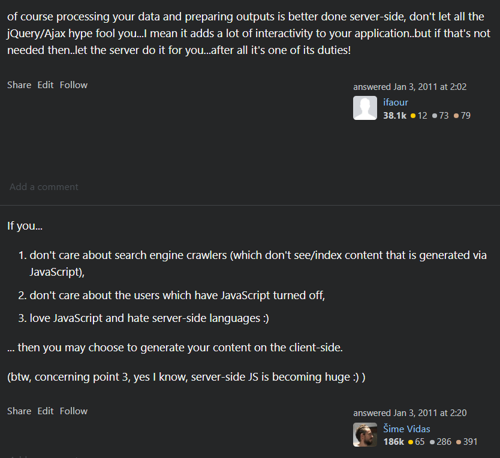

# [Theoretical Basis: HATEOAS](https://htmx.org/essays/hateoas/)

With HATEOAS, a REST client needs little to no prior knowledge about how to interact with an application or server beyond a generic understanding of hypermedia.

By contrast, today JSON-based web clients typically interact through a fixed interface shared through documentation via a tool such as swagger.

The restrictions imposed by HATEOAS decouples client and server. This enables server functionality to evolve independently.
#### EXAMPLE:

Consider this GET request, issued by a web browser, which fetches a bank account resource:

```txt
GET /accounts/12345 HTTP/1.1
Host: bank.example.com
```

The server responds with a hypermedia representation using HTML:

```html
HTTP/1.1 200 OK

<html>
  <body>
    <div>Account number: 12345</div>
    <div>Balance: $100.00 USD</div>
    <div>Links:
        <a href="/accounts/12345/deposits">deposits</a>
        <a href="/accounts/12345/withdrawals">withdrawals</a>
        <a href="/accounts/12345/transfers">transfers</a>
        <a href="/accounts/12345/close-requests">close-requests</a>
    </div>
  <body>
</html>
```

The response contains following possible follow-up actions..

Consider the situation after the account has been overdrawn:

```html
HTTP/1.1 200 OK

<html>
  <body>
    <div>Account number: 12345</div>
    <div>Balance: -$50.00 USD</div>
    <div>Links:
        <a href="/accounts/12345/deposits">deposits</a>
    </div>
  <body>
</html>
```

In the account's current overdrawn state the other actions are not available, and this fact is reflected internally in _the hypermedia_. The web browser does not know about the concept of an overdrawn account or, indeed, even what an account is. It simply knows how to present hypermedia representations to a user.

Hence we have the notion of the Hypermedia being the Engine of Application State. What actions are possible varies as the state of the resource varies and this information is encoded in the hypermedia.
#### JSON version:

```json
HTTP/1.1 200 OK

{
    "account": {
        "account_number": 12345,
        "balance": {
            "currency": "usd",
            "value": -50.00
        },
        "status": "overdrawn"
    }
}
```

Here we can see that the client must know specifically what the value of the `status` field means and how it might affect the rendering of a user interface, and what actions can be taken with it.

The client must also know what URLs must be used for manipulation of this resource since they are not encoded in the response. This would typically be achieved by consulting documentation for the JSON API.

# Practical Benefits:

#### [NextJS to HTMX](https://htmx.org/essays/a-real-world-nextjs-to-htmx-port/)

- _Dependencies are **reduced by 87%** (**24** to **3**!)_
- _I wrote **less code by 17%** (**9500 LOC** to **7900 LOC**.) In reality the total LOC of the code base is **reduced by more than 50%**, since much less code is imported from the dependencies._
- _Web build time was **reduced by 100%** (there’s **no build step** anymore.)_
- _Size of the website **reduced by more than 85%** (**~800KB** to **~100KB**!)_
#### [React to HTMX](https://htmx.org/essays/a-real-world-react-to-htmx-port/)

- _The effort took about **2 months** (with a 21K LOC code base, mostly JavaScript)_
- _**No reduction** in the application’s user experience (UX)_
- _They reduced the **code base size** by **67%** (21,500 LOC to 7200 LOC)_
- _They _increased_ **python code** by **140%** (500 LOC to 1200 LOC), a good thing if you prefer python to JS_
- _They reduced their total **JS dependencies** by **96%** (255 to 9)_
- _They reduced their **web build time** by **88%** (40 seconds to 5)_
- _**First load time-to-interactive** was reduced by **50-60%** (from 2 to 6 seconds to 1 to 2 seconds)_
- _**Much larger data sets were possible** when using htmx, because react simply couldn’t handle the data_
- _Web application **memory usage** was reduced by **46%** (75MB to 45MB)_

"After the port to htmx, _the entire team_ became “full stack” developers. This means that each team member is more effective and able to contribute more value. It also makes development more fun, since developers can own an entire feature. Finally, it can lead to better optimized software, since the developer can make optimizations anywhere in the stack without needing to coordinate with other developers."

# [JSON VS HTML](https://github.com/1cg/html-json-speed-comparison)

This is speculation, however, and my take-away from all this is **not** that HTML is faster than JSON: I'm sure with a well tuned JSON serialization mechanism the JSON responses can be made faster than the HTML responses. Rather it is that the two approaches are very close to one another and are probably round off errors in the overall scheme of total system performance. Once you hit a data store, or add in real-world latency between the client and server, these differences vanish in the wash.

As such, my opinion continues to be that server-side render performance is _not_ a reason to choose either a JSON-based approach or a hypermedia/HTML based approach to building your web application. You instead should use other criteria for picking between the two.

### [When should you return hypermedia?](https://htmx.org/essays/when-to-use-hypermedia/)

-  _If your UI is mostly text & images_
- _If your UI is CRUD-y_
- _If your UI is “nested”, with updates mostly taking place within well-defined blocks_
- _[UI Driven Hypermedia APIs](https://htmx.org/essays/hypermedia-apis-vs-data-apis/)_
- _If you need “deep links” & good first-render performance_

### When should you not return hypermedia?

- _If your UI has many, dynamic interdependencies_
- _If you require offline functionality_
- _If your UI state is updated extremely frequently_
- _If your team is not on board_

To give an example of two famous applications that we think _could_ be implemented cleanly in hypermedia, consider Twitter or GMail. Both web applications are text-and-image heavy, with coarse-grain updates and, thus, would be quite amenable to a hypermedia approach.

Two famous examples of web applications that would _not_ be amenable to a hypermedia approach are Google Sheets and Google Maps. Google Sheets can have a large amounts of state within and interdependencies between many cells, making it untenable to issue a server request on every cell update. Google Maps, on the other hand, responds rapidly to mouse movements and simply can’t afford a server round trip for every one of them. Both of these applications require a much more sophisticated client-side setup than what hypermedia can provide.

Of course, the vast majority of web applications are nowhere near the scale and complexity of these examples. And almost every web application, even Google Sheets or Google Maps, has parts where, potentially, the hypermedia approach would be better: simpler, faster and cleaner.

# Famous Hypermedia Driven APIs:
#### [Github REST API](https://docs.github.com/en/rest/using-the-rest-api/getting-started-with-the-rest-api?apiVersion=2022-11-28#hypermedia)
#### [PayPal REST API](https://developer.paypal.com/api/rest/responses/#hateoas-links)

# Further reading:

- #### [REST APIs must be hypertext-driven](https://roy.gbiv.com/untangled/2008/rest-apis-must-be-hypertext-driven "Permanent Link: REST APIs must be hypertext-driven"), article by Roy T. Fielding (one of the principal authors of the HTTP specification and the originator of the REST architectural style. ([wikipedia](https://en.wikipedia.org/wiki/Roy_Fielding))
- #### [Reflections on the REST Architectural Style and “Principled Design of the Modern Web Architecture”](https://static.googleusercontent.com/media/research.google.com/en//pubs/archive/46310.pdf), paper by Roy T. Fielding
- #### [REST: I don't Think it Means What You Think it Does](https://www.youtube.com/watch?v=pspy1H6A3FM), presentation by Stefan Tilkov
- #### [Locality of Behaviour (LoB)](https://htmx.org/essays/locality-of-behaviour/), article by Carson Gross

### Some extra comments:



"That this does not map all to well to OO designs is not the problem of REST but the incapability of OO languages to adopt to changes in their class models on the fly. While it is technically possible to maintain the received data in generic data trees such as maps, collections or dictionaries (or whatever they are called in your OOP language of your choice), usually the data is mapped to concrete business objects assuming that the data already follows a certain domain model, which usually leads to failure if something unexpected appears in that data.

The OOP vs. REST problems are similar to comparing SQL tables to MongoDB collections. The former one has a rigid (table) structure not allowing for adding or removing fields easily and supporting nested entries while the latter one shines on such features though might end up with more wasted space and maybe slower response times due to less efficient indices. Fielding mentioned that if you introduce a breaking change it might be better to deploy the new version of the service to a new host and consider both version as different applications. That way old clients still have the old server to talk to while new clients contact the new server."
-[Kessra on Youtube](https://www.youtube.com/watch?v=pspy1H6A3FM&lc=UgylvdFczunLxdJQJMZ4AaABAg.8dl6k_neMhw8rqXi2za7Yt)
